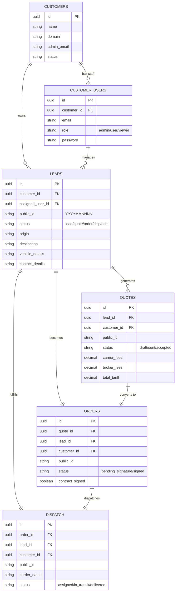
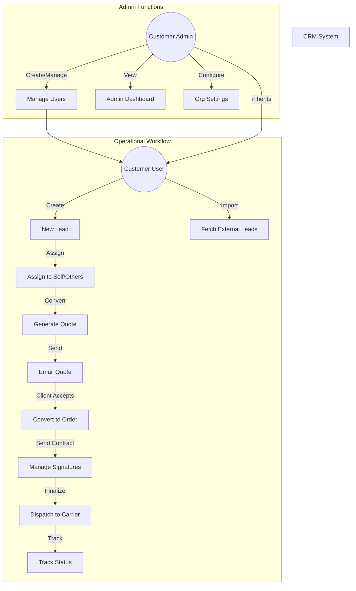
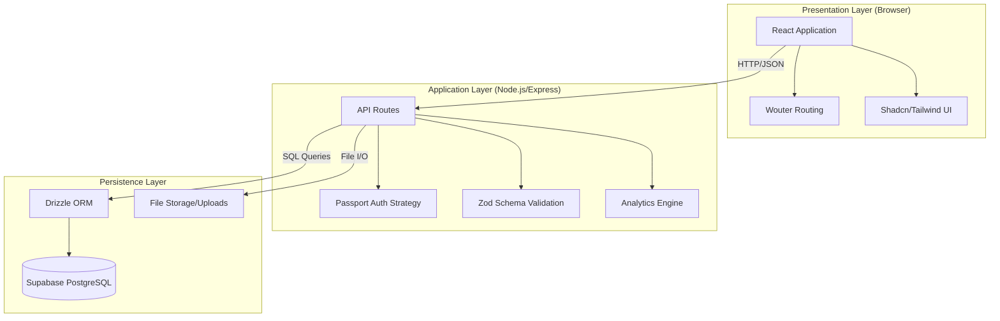

# Software Requirements Specification (SRS)

## 1. Introduction
This document outlines the software requirements, database structure, and system architecture for the CRM (Customer Relationship Management) system designed for Vehicle Shipping and Logistics.

## 2. Entity-Relationship (ER) Diagram
The following diagram illustrates the database schema, including entities such as Customers (Tenants), Users, Leads, Quotes, Orders, and Dispatch records, along with their relationships.

## 3. Use Case Diagram
This section details the interactions between the system actors (Super Admin, Customer Admin, Customer User) and the core modules (Lead, Quote, Order Management).

## 4. Architectural Diagram
The system follows a modern full-stack architecture using a monolithic repository structure with clear separation of concerns between Client and Server.

### Tech Stack
*   **Frontend**: React, Vite, TailwindCSS (UI), Shadcn/Radix (Components).
*   **Backend**: Node.js, Express (API), Passport (Auth), Multer (Uploads).
*   **Database**: PostgreSQL (via Supabase), Drizzle ORM (Data Access).

## 5. System Features
### 5.1 Lead Management
*   **Centralized Intake**: Manual entry or API integration for importing leads.
*   **Unified ID**: A generic `public_id` (YYYYMMNNNN) persists across the entire lifecycle (Lead -> Quote -> Order -> Dispatch).
*   **Assignment**: Leads can be assigned to specific users for follow-up.

### 5.2 Financials & Quoting
*   **Tariff Calculation**: Separate tracking for Carrier Fees, Broker Fees, and Total Tariff.
*   **Quote Generation**: Automatic generation of quotes from lead data.
*   **Status Tracking**: Track quotes from Draft -> Sent -> Accepted.

### 5.3 Order Fulfillment
*   **Contract Management**: Digital contract generation and signature tracking.
*   **Dispatching**: Assign carriers, drivers, and truck info to confirmed orders.
*   **Status Updates**: Track shipment form 'Assigned' to 'Delivered'.
